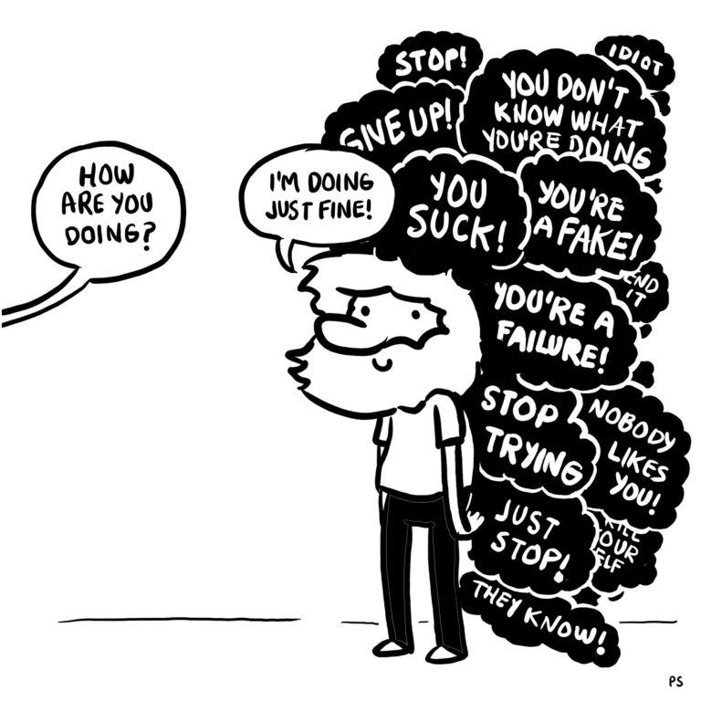

### How to go through life without feeling like an imposter

I have heard more than once from colleagues, that during their career they have felt underqualified for their job description. For me, it was
a rude inner voice telling me: "You don't deserve to be here, these people are very smart." The imposter syndrome is a 
feeling of unworthiness when it comes to your achievements, and it is easily identifiable, through having modesty and the
feeling that all your successes are pure and simple luck. I hope my lucky streak continues!
The begining of my software development carreer was unnecessarily challenging for me. On the one hand, coming to a company where 
all my colleagues are renowned professionals in the industry ([Codurance](https://codurance.com)), and on the other hand, to enter an apprenticeship program where my fellow 
peers have different levels of experience and expertise, and by then I felt that all of them were better qualified than I was.
In this post, I will talk about the practices that helped me overcome the fear of getting called out on my self-imposed 
feelings of inexperience and under qualification.

### Don't look for the bouncer

As [Lou Solomon](https://www.youtube.com/watch?v=whyUPLJZljE) put it in her talk about imposter syndrome, we feel like we came into a theater through the back door and we're now on stage, but we're looking for the bouncer, and if he sees us, 
we're getting kicked out. Well let me tell you right now, there is no bouncer. Constantly looking over your shoulder for someone looking for you to make a mistake or doubt your capabilities only brings anxiety and self-doubt. One of the great virtues of a good working enviroment is that there are colleagues, mentors, and guides that can support you in your learning process and who are willing to explain and move you forward. There is no shame in not doing your task to perfection, 
which brings me to the next point.

### You don't have to always crush it

One of the feelings that’s associated with the imposter syndrome is the need to crush every project just to feel on par with your peers. This is due to the terrible phrase mentioned by our little inner voice. I'm going to tell you quickly and simply so that you remember it, *It's impossible to do everything right all the time*. In the company I work for, there are moments in which I'm not be able to complete a task by myself or in which a concept will be too complicated (or course by now you realize that I'm quite a junior developer). Knowing how to identify when to ask for help and learn from your ignorance is very important. As the phrase goes: "Perfection is the enemy 
of good." Perfectionism brings with it the fear of failure... but hey! not everything is terrible since life has this great quality of allowing these failures and falls, simply learn from them and move on.

### Don't be scared to air your dirty laundry

There is a saying, "Don't air your dirty laundry." I will give you a word of advice, you should throw this saying out the window. For someone who has the imposter syndrome, I know that this is so difficult to follow, but showing your vulnerabilities has been something that over time has been taught to us as a symptom of weakness, and that's precisely what we want to avoid, isn't it? Well for me, overcoming this was my salvation. Once I started talking about my shortcomings the path became much easier. Not understanding DDD or another acronym (those are the worst) is not the end of the world, but hey! Suffering for every little mistake is essential for a perfectionist right? Just talk, express your doubts, and share your weaknesses, everyone will benefit from it, even you. "Talkers have always ruled."

### Everyone feels like this once in a while

[Mike Cannon-Brookes](https://www.youtube.com/watch?v=ZkwqZfvbdFw), the founder of Atlassian, mentions in his TED Talk, 
that during his life he has felt like an imposter even in the highlights. During the entrepreneur of the year award, he expressed his feeling to Belmiro de Azevedo the 605th richest person in the world, who confessed feeling the same way. Belmiro 
de Azevedo’s response was:

> _"You're obviously doing something right, just keep doing it.”_

We assume that successful people do not question their ideas or knowledge, well that is not true, but they are not afraid to ask for advice. It is ok to feel that sometimes you are out of your depth, as long as you don't freeze, but instead try 
to harness those feelings and use them for good.

### A last word of advice

Imposter syndrome is something that you can't completely get rid of. That inner voice is always there looking for flaws to grab onto. My final advice is to be aware of your voice. Once you understand the voice, 
you can do something about it. Ask for help, there is certainly people in your company willing to help you out and want you to succeed (if there isn't then you're in the wrong place). 
Lastly don't make yourself suffer because of small mistakes, you're going to commit plenty. It’s how you grow and learn 
from them that matters.
